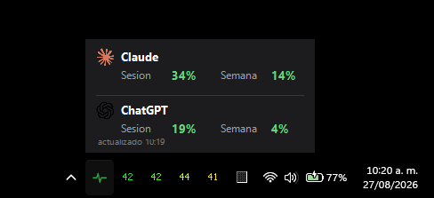

# Pulse

A single tray icon for Windows that shows how close you are to your **Claude** and
**ChatGPT** usage limits — session and weekly, for both — without ever opening either
app's Settings page.

Hover the icon and a small popup shows both providers, each value colored green /
amber / red depending on how close you are to the limit.

## Why

Both claude.ai and chatgpt.com bury your usage percentage a few clicks deep in
Settings. Pulse reads it from the same free, no-token-cost account-usage endpoints
those settings pages use, on a 5-minute timer, and surfaces it as a tray icon.

## How it works

- Reads the OAuth tokens that `claude` (Claude Code CLI) and `codex` (OpenAI Codex
  CLI) already save locally after you log in with them once:
  - `%USERPROFILE%\.claude\.credentials.json`
  - `%USERPROFILE%\.codex\auth.json`
- Calls:
  - `GET https://api.anthropic.com/api/oauth/usage`
  - `GET https://chatgpt.com/backend-api/wham/usage`
- These are metadata/account endpoints, not the paid Messages/Completions API - polling
  them never consumes tokens or credits.
- Renders a native Windows tray icon (a heartbeat line, color = worst of the four
  numbers) plus a custom "no-activate" popup window on hover (the built-in
  `NotifyIcon` tooltip can't do multi-line text, per-value colors, or icons).

## Requirements

- Windows 10/11.
- [Claude Code CLI](https://claude.ai) installed and logged in natively on Windows
  (`claude` in a fresh PowerShell window).
- [OpenAI Codex CLI](https://github.com/openai/codex) installed and logged in
  natively on Windows with your ChatGPT account (`codex login`).

Both CLIs auto-refresh their saved token on normal use, so Pulse stays accurate as
long as you touch either tool now and then. If a reading ever shows "?", the token
went stale — just run `claude` or `codex` once to refresh it.

## Install

1. Clone this repo to `D:\Development\Pulse` (or edit the path in
   `Launch-Pulse.vbs` to wherever you put it).
2. Run `Launch-Pulse.vbs` once to confirm it works.
3. (Optional) Put a shortcut to `Launch-Pulse.vbs` in
   `shell:startup` so Pulse starts with Windows.

## Why a `.vbs` launcher instead of just running the `.ps1`

On Windows 11, `powershell.exe -WindowStyle Hidden` can still flash a console window
because Windows Terminal (the default terminal host) doesn't always honor it. The
`.vbs` wrapper launches PowerShell through `WScript.Shell.Run(..., 0, False)`, which
reliably produces zero visible window.

## License

MIT
